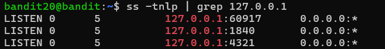

### Level 20 -> Level 21

**Goal** 
---
Connect to bandit20 and run the setuid binary file that,
1. Connects to localhost to a port I specify in the commandline
2. After successfull connection, It reads a line from the connection established
3. It compares it to the password of the current level(_bandit20_)
4. If matches, it ll return the password of the next level

---
**Learnings** 
---
- this is the binary file with permission bits
    + -rwsr-x---  1 bandit21 bandit20 15608 Apr 10 14:23 <u><b>suconnect</b></u>
- lets connect to the port the bandit game is on - 2220
    + `./ suconnect 2220` but got the Error ***"ERROR: This doesn't match the current password!"***
- The Error above says not matching with the current password, does that mean it is expecting a password? ❌ No thats not it
- As per the earlier experience all levels are hosted in some internal ports like - 30000, 51917 etc. 🤔 I have to find a port. But how?
- First I need to figure out which is the port I am standing
    + `printenv` and look for something =`SSH_CONNECTION=49.37.36.52 52108 10.0.1.228 2220`  -here 
        * `49.37.36.52` is client IP
        * `52108` is client port
        * `10.0.1.228` is Internal server IP
        *  `2220` is server port where the bandit game is hosted. 
    - 🤔 I Have to find a port something like `52108` may be in range of `30000-60000` But it has to be open
- To check which other ports are available and open - 
    + `ss -tnlp` Socket Statistics - to get all the ports its currently running localhost + server
        - `-t` is for TCP ports
        - `-n` show numeric IPs
        - `-l` show listning sockets
        - `-p` show process name/IDs
    + From the long list I am interested for only IPs looks like `127.0.0.1:?????` because thats the local host IP address
        
    + I can np to check which one has some active process and which one is free - `nc localhost 60917,1820,4321`
- **_Checkpost 1:_** ✅ Connects to localhost to a port I specify in the commandline
- i have got few open ports `60917` & `1820` (`4321` is giving some wierd shit OP).
- Lets `./suconnect` into these ports
    * While `.suconnect 60917` looks like it is expecting some input - must be the password of _bandit20_
    * Nope, its just hanging there for a bit returns `ERROR: This doesn't match the current password!` 

--- 
#### What I have:
1. A binary **_suconnect_** that connects to a TCP port on localhost ✅
2. It expects the password for _Bandit20_ to be sent from the other side of the TCP connection (i.e., my client) -  🗣️👂 Expects a Client-Server interaction
3. If the password I send matches _Bandit20_’s password, it sends back Bandit21’s password.
4. I have to specify the port number on the command line when running `./suconnect`

#### What I need to do:
- basically have to act as the network client talking to your own daemon (that suconnect connects to).
- Here’s the twist: suconnect is the client connecting to a local server listening on that port.
- I need to run a server on that port, establish connection with _suconnect_, send the Bandit20 password from server, and then read the next password from the connection.

- Use `tmux` to open two Terminals - T1(acts server) & T2(acts client)
    * `tmux new -s severBandit` - launch a new T1 session
    * [Ctrl + b] > %    :: Verical split
    * [Ctrl + b] > ⬅️ and ➡️ arrow keys  :: To navigate b/w T1 and T2
    * `exit`    :: Close Pane
    * `tmux ls` - List of tmux sessions
    * `tmux kill-session -t severBandit` - Kill the session

#### The Course of Actions
1. On Terminal 1: Launch a server on the localhost on a open port - **'severBandit'** on T1
    -  Try `nc -l -p 60917` - `-l` listen mode. it launches a server on `-p` the port `60917`
    - ❌ OP:: `nc: Address already in use` - Not able to launch as its already in use - Means my current session is running on `60917`
    - Use a different one `nc -l -p 1820` - ✅ Server initiated on T1 on `1820`
2. On T2: run `./suconnet 1820` - ✅ Now _suconnect_ is listening to the port `1820`
3. On T1: enter the password on _bandit20_ - ****************
4. On T4: It listens the password provided. And returns OP:: **_"Password matches, sending next password"_**
5. On T1: 🎉 Password to next level displayed

---
**Outcome** 
---
Goal Reached! <!-- Password to next level:: `EeoULMCra2q0dSkYj561DX7s1CpBuOBt` -->