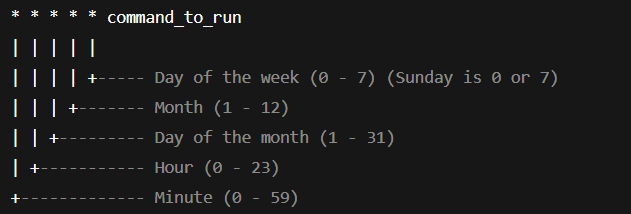
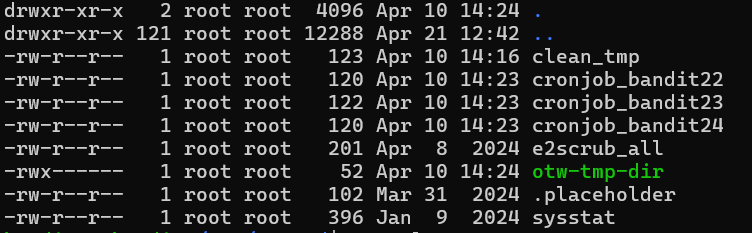
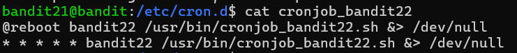
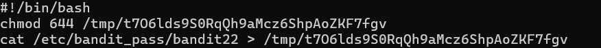

### Level 21 -> Level 22

**Goal** 
---
Connect to bandit21 and find the scheduled jobs which runs automatically at given interval.
- Look in ` /etc/cron.d/` for the configuration files to understand what jobs run periodically
- Password can be somewhere arround

---
**Learnings** 
---

#### What is cron?
- **cron** is a job scheduler for unix like systems. 
- It runs a given command at given point of time, date or day
    * follows this pattern - `* * * * * <command>` = `Min Hour DayOfMonth Month DayOfWeek <command_to_run>`
    
    * Example:: `30 14 * * 1 /home/abhi/cleanup.sh` -> (* means ANY)
- Useful commands
    * `crontab -e`  -> to edit
    * `crontab -l`  -> List all jobs
    * `crontab -r`  -> to remove
- After editing it stores the cronjob under `/tmp/tmp_dir/` - Next if we edit it again it'll remove the older version and keeep the new version in a diff /tmp/ location

#### Back to challenge
- When i look into this '/etc/cron.d', I can see few files some are regular some are named as 'cronjob--'

- I checked few of the Jobs nothing much but 'bandit22' related jobs would be the the file of interest
- Lets `cat` into the `cronjob_bandit22`
    + Saw this 
    
    + So some script will be running which sits in this location - '/usr/bin/cronjob_bandit22.sh'
+ lets `cat` into this '/usr/bin/cronjob_bandit22.sh'
    + 
    + this script is `chmod 644` (User=Read+Write; Group=Read; Other=Read) some file in '/tmp/t7O6lds9S0RqQh9aMcz6ShpAoZKF7fgv'
    + But `t7O6lds9S0RqQh9aMcz6ShpAoZKF7fgv` This is not what it looks like - its just name of a file where the password from `/etc/bandit_pass/bandit22` kept
    + Fun fact: As a _bandit22_ I dont have access to `/etc/bandit_pass/bandit22` But Thanks to `CHMOD 644` I can now read and `cat` into `/tmp/t7O6lds9S0RqQh9aMcz6ShpAoZKF7fgv`
    + And Guess what's there!
---
**Outcome** 
---
Goal Reached! <!-- Password to next level:: `tRae0UfB9v0UzbCdn9cY0gQnds9GF58Q` -->