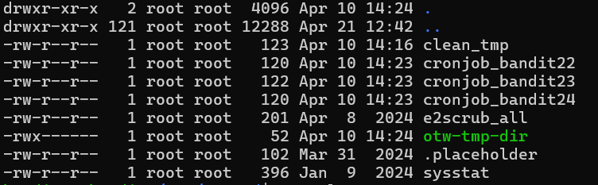

### Level 22 -> Level 23


**Goal**<br>
---
Connect to bandit22 go to '/etc/cron.d' to see the `cronjob`
- Checkout the configuration to figure out what script is running
- debug the .sh script to get the 🔑

---
**Learnings**<br>
---
- once `cat /etc/cron.d`  I can see the files named as 'cronjob--'<br>

- `cat cronjob_bandit23` to get the location of the `.sh` and take a peek into `cat /usr/bin/cronjob_bandit23.sh `
- OP:: <br>
```sh
#!/bin/bash
myname=$(whoami)
mytarget=$(echo I am user $myname | md5sum | cut -d ' ' -f 1)
echo "Copying passwordfile /etc/bandit_pass/$myname to /tmp/$mytarget"
cat /etc/bandit_pass/$myname > /tmp/$mytarget
```
- Lets break it down - 
    * `whoami` -> bandit22 (currently)
    * `md5sum` is a light encrytion protocol that is used to verify any file.
        + It returns a 128-bit hash (usually shown as a 32-character hexadecimal number) 
        + Example 1:: `md5sum someFile` | OP:: `8169b67bd894ddbb4412f91573b38db3 somefile`
        + Example 2:: `echo happy | md5sum` | OP:: `5eaaf94141c371ce96675aa6445003c4`
        + the hex hash is consistent - Like every time same hash for same file
        + Can be use as a 🔑 to check the authenticity of a file peer-to-peer
        + This is a oneway street. Cannt decrypt back to the original file or text
    * `cut -d ' ' -f 1` is to cut a specific field (column) from a line of text, where the fields are separated by a delimiter
        + `-d ' '` -> specifying dilimiter in this case, a space ' '
        + `-f 1` -> Take the first substring/field
        + E.g. 'Happy New Year' - `cut -d ' ' -f 1` - OP:: 'Happy'
    > cat /etc/bandit_pass/$myname > /tmp/$mytarget
    * `/etc/bandit_pass/$myname` = here $myname needs to be **_bandit23_**
    * `echo I am user bandit23" | md5sum | cut -d ' ' -f 1` 
        <br>OP:: `8169b67bd894ddbb4412f91573b38db3`
    * Lets sneak into '/tmp/8169b67bd894ddbb4412f91573b38db3'
    * Done!

---
**Outcome**<br>
---
Goal Reached! <!-- Password to next level:: `0Zf11ioIjMVN551jX3CmStKLYqjk54Ga` -->