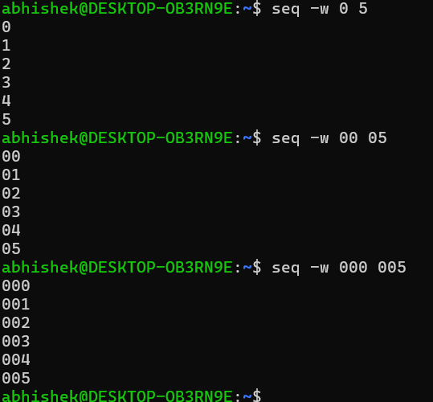

### Level 24 -> Level 25


**Goal**<br>
---
Connect to bandit24 and find out the password 
- A daemon/program is listening to the port `30002`
- Daemon expectes `<bandit24 pwd> <4digit pin>` that unlocks the password to the next level
- the 4 digit pin can be anything from `0000 - 9999`
- Only way to find the pin is brute force

---
**Learnings**<br>
---
- once connecting to `nc localhost 30002` - the daemon expects the Key 🔑 which consists of two things
    1. _bandit24 password_ -> I have ✅
    2. 4 digit Pin  -> I Donot have ❌
- The only way to find out the correct pin is to hit and try all possible combinations - Brute Force
- To achieve that, I need a script which Launches `nc` and hit it with all possible 🔑, in a loop 

### The Brute Force Logic
---
1. Need a `for` loop starting from 0 and goes till 9999 - `for i in (0 9999)`
    - This returns number like - 3, 28, 196 ... not 4 digit untill 999
    - solution - `$("%04d"$i)` - it makes the length of the number 4 digit. with prefixing Zero's -> 0078, 0007, ...
    + OR
    - We can use this command to generate sequential numbers with the padded digits of our needs - `seq -w 0000 9999`
    - `-w` add leading zeroes if needed
    - 
    - Lets trap this sequence in a `for` loop -> `for i in $(seq -w 0000 9999);`
2. Now inside the loop we have to make the key 🔑 -> `<bandit24 pwd> $i`
    - And hit the daemon which is launched, repeatedly
---

- Now in the script, I just launch the `nc` and under `for` loop I use the generated key 🔑 - Simple Right?
- [ATTEMPT-1](https://github.com/mrSky-lurk/linux-ctf-otw-bandit/blob/main/Challenge_25/script.sh#L1-L10)
```sh
#!/bin/bash
echo "lets start..."
nc localhost 30002 | tee samplelogs.log
sleep 0.2
for i in $(seq -w 0000 0010); do
        echo "gb8KRRC****************jiZbf3G8 $i" | tee -a samplelogs.log
        sleep 0.2
done
```
- ❌ Not working


### The Challenge
---
- The `nc` process once launched its stuck to the user input. Not moving forward and enter the For loop
- **Modification** - Running the process in backgroud - `nc localhost 30002 | tee samplelogs.log &` 
    + ❌ Not helping. It does go inside the for loop but spiting the `echo` on the terminal
    + `nc` still running in background and expecting input.
    + `echo` is not acting as input here
- Even if this code works, I still have a huge dump of 10000 combindation on Key 🔑 and output in 'samplelogs.log' file to go through and find which actually worked
---
- I have to feed the `nc` with the 🔑 one by one and break the loop once successful
- If I have two terminals and run `nc` in one and feed the 🔑 from another it might work
    + I `tmux new -s terminal1` and created two terminals T1(id=0) & T2(id=1)
    + In T1 `nc localhost 30002` - Now I need a script that'd be run from T2 and sends input to T1
    + Check for `tmux` ids - `tmux ls`
    + Send inputs to T1 (id=0) -  `tmux send-keys -t 0 "🔑" Enter` - It worked ✅
- Only sending the input not help, I need to capture the Output message to verify whether the 🔑 worked - 🔓 or need to go on trying
- To capture the output on the T1(id=0) - `tmux capture-pane -p -t 0 > reply.log` and store it in 'reply.log' during each iteration
- Use `tmux capture-pane -p -t 0 | grep -v '^$' > reply.log` - As we need only the text part from T1 not the extra blank non charecter lines
- Now Read 'reply.log' and only last 2-3 lines are fine `if` it is showing ***WRONG! ...*** then no luck `else` break the loop;
-  [FINAL ATTEMPT with tmux](https://github.com/mrSky-lurk/linux-ctf-otw-bandit/blob/main/Challenge_25/script.sh#L43-L67)

***This Challenge can be done with back ground process and Named input piping (FIFO) Lets give it a try later***


---
**Outcome**<br>
---
Goal Reached! <!-- Password to next level:: `iCi86ttT4KSNe1armKiwbQNmB3YJP3q4` -->