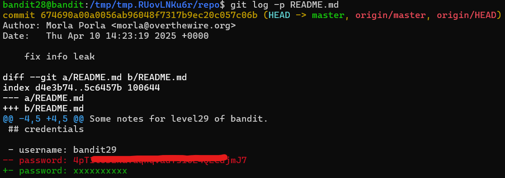

### Level 28 -> Level 29

**Goal** 
---
Connect to _bandit28_
- Clone a git repo from _ssh://bandit28-git@localhost/home/bandit27-git/repo_ via the port `2220`. The password for the user _bandit28-git_ is the same as for the user _bandit28_.
- Find the password lying around 

---
**Learnings** 
---
- Repo is clonned
- But this time there is nothing useful under `README.md`
    + Can see the 'password' section but only X's - masked
- Lets read the previous commits + diffs it might contain the details 
    + `git log -p README.md` - shows the last commits with diffs
    + And can see the key 🔑 under the diffs 
    

---
**Outcome** 
---
Goal Reached! <!-- Password to next level:: `4pT1t5DENaYuqnqvadYs1oE4QLCdjmJ7` -->