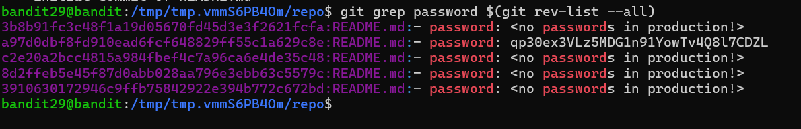

### Level 29 -> Level 30

**Goal** 
---
Connect to _bandit29_
- Clone a git repo from _ssh://bandit29-git@localhost/home/bandit29-git/repo_ via the port `2220`. The password for the user _bandit29-git_ is the same as for the user _bandit29_.
- Find the password lying around 

---
**Learnings** 
---
- Repo is clonned
- Under the 'password' section in `README.md`, this is written - _"<no passwords in production!!>"_
- checking the old commits + diffs of `README.md` did not help here with `git log -p README.md`
- To check all commits to the Repository - `git rev-list --all`
    + This will spit out all the previous commits(hash) to the whole repo from any Branch available
    + In this case there are 5 commits total

❓Then why `git log -p README.md` not shows other commits ?
- `git log -p README.md` only shows the important commits and git **supresses** commits like 
    1. commits to other files apart from README.md
    2. commits to file that reverted back by later-commits
    3. Merge commits
    4. etc

- To see the contents and diffs for this hashes - `git show <hash>`
- One by one hit each hash to see the contents, and one of thme is holding the 🔑

- Alternatively, I can directly `git grep` the 🔑 as the template of README.md contains the keyword "password"
    + `git grep password: $(git rev-list --all)`
    + it ll look into all the commits by executing `$(git rev-list --all)` and `grep` the keyword 'password' and list all occurances

---
**Outcome** 
---
Goal Reached! <!-- Password to next level:: `` -->