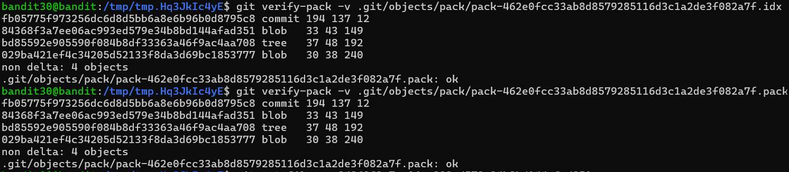
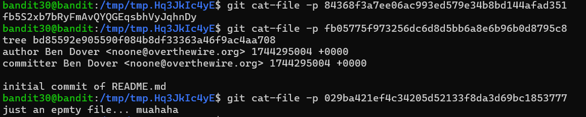

### Level 30 -> Level 31

**Goal** 
---
Connect to bandit30
- Clone a git repo from _ssh://bandit30-git@localhost/home/bandit30-git/repo_ via the port `2220`. The password for the user _bandit30-git_ is the same as for the user _bandit30_.
- Find the password lying around 😈

---
**Learnings** 
---
- Repo is clonned
- Under the 'password' section in `README.md`, this is written (hopefully spell check not turned on) - _"This is an **epmty** file... muahaha!!"_
- When `git rev-list --all` or `git log` only one commit is seen i.e. the initial commit nothing else
- I can see a _objects_ folder insiide _.git_
    + Its an attributein git, as part of `gc` it creates packets
    + These packents are like compressed objects but in smaller size
    + When a repo is cloned these packets are kept inside objects folder
    + Inside objects folder these type of files can be seen - (observe the same hash but differect extn)
        1. `.git/objects/pack/pack-f3e21b8d621f1f5a3f3e68c4d1f12104b06a1234.pack` - This "pack-<hash>.pack" is the actual packfile, a binary blob of many compressed Git objects.
        2. `.git/objects/pack/pack-f3e21b8d621f1f5a3f3e68c4d1f12104b06a1234.idx` - This is index of corresponding '.pack'
        3. `.git/objects/pack/pack-f3e21b8d621f1f5a3f3e68c4d1f12104b06a1234.rev` - This is commit of the corresponding '.pack'
    + 
    + There can be 3 or more types of objects corresponding for a pack as seen in the pic below
        1. `commit` type object - holds a commit details
        2. `blob` type object - a file
        3. `tree` type object - the pointer to a `blob` object or another `tree` - like reference path/locator
        +   command to check/verify - `git verify-pack -v .git/objects/pack/pack-462e0fcc33ab8d8579285116d3c1a2de3f082a7f.pack`
        + 

- Its clear that `blob` are the persons of interest
- if we `git cat-file -p 84368f3a7ee06ac993ed579e34b8bd144afad351` (this is the blob hash) - we can see the 🔑
- 
- 
- 
- Alternatively, we can `git show 84368f3a7ee06ac993ed579e34b8bd144afad351`

---
**Outcome** 
---
Goal Reached! <!-- Password to next level:: `fb5S2xb7bRyFmAvQYQGEqsbhVyJqhnDy` -->